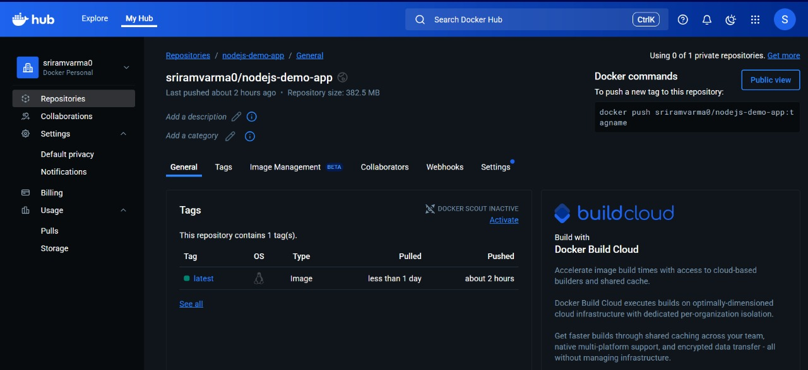
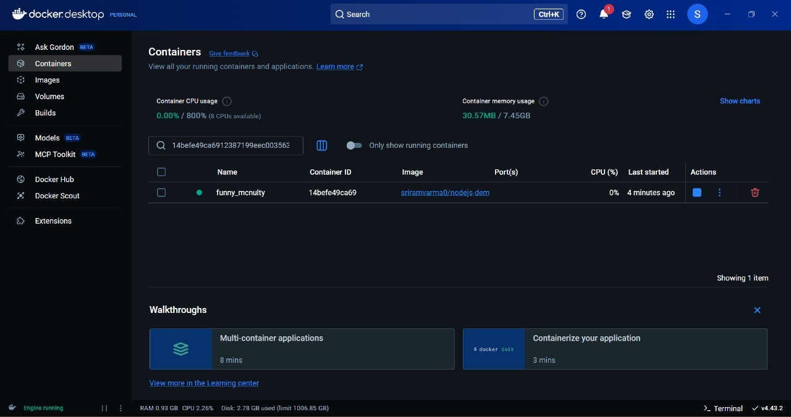
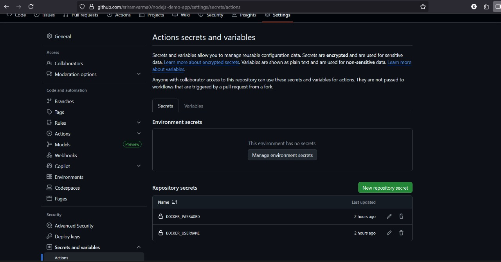
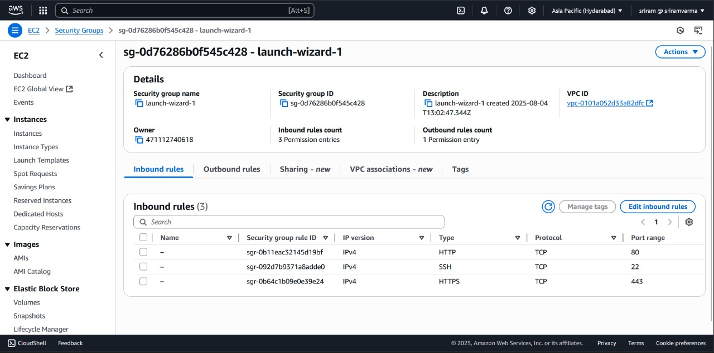

# 🚀 Node.js Dockerized App with GitHub Actions and AWS EC2

This project is a Node.js application deployed using a professional DevOps pipeline. It includes containerization with Docker, automated CI/CD with GitHub Actions, and cloud deployment via AWS EC2. The web app features an animated "Coming Soon" landing page.

---

## 🌐 Live Deployment

> 🟢 **Live URL**: [http://18.61.29.250/](http://18.61.29.250/)

---

## 🧰 Tech Stack

- **Frontend**: HTML, CSS (Animated Landing Page)
- **Backend**: Node.js
- **Containerization**: Docker
- **CI/CD**: GitHub Actions
- **Registry**: Docker Hub
- **Cloud Deployment**: AWS EC2 (Amazon Linux 2)

---

## 📂 Project Structure

```bash
nodejs-demo-app/
├── .github/
│   └── workflows/
│       └── build-and-deploy.yml     # GitHub Actions CI/CD pipeline
├── Dockerfile                       # Docker image definition
├── index.html                       # Animated UI page
├── package.json                     # Node.js dependencies
├── server.js                        # Express server
├── README.md                        # Project documentation
└── screenshots/                     # All screenshots for reference
    ├── dockerhub-image.jpg
    ├── docker-ps.jpg
    ├── ec2-instance.jpg
    ├── github-actions.jpg
    ├── github-secrets.jpg
    └── security-group.jpg
```

---

## 🖼️ Screenshots

### 🔹 Docker Hub Repository  


### 🔹 Docker Container Running Locally  


### 🔹 AWS EC2 Instance Running the App  


### 🔹 GitHub Actions Workflow Run  


### 🔹 GitHub Secrets for CI/CD  


### 🔹 EC2 Security Group Settings  

---

## ✈️ Run Locally

### 1. Clone the Repository

```bash
git clone https://github.com/sriramvarma0/nodejs-demo-app.git
cd nodejs-demo-app
```

### 2. Install Dependencies

```bash
npm install
```

### 3. Start the App

```bash
node server.js
```

> Access: [http://localhost:3000](http://localhost:3000)

---

## 🛠️ Dockerized Setup

### Build Docker Image

```bash
docker build -t sriramvarma0/nodejs-demo-app .
```

### Run Docker Container

```bash
docker run -d -p 3000:3000 sriramvarma0/nodejs-demo-app
```

---

## 🚧 GitHub Actions CI/CD Pipeline

### Location: `.github/workflows/build-and-deploy.yml`

#### Steps:

- Checkout code
- Setup Node.js
- Install dependencies
- Build Docker image
- Login to Docker Hub
- Push image to Docker Hub

#### Secrets Used:

- `DOCKER_USERNAME`
- `DOCKER_PASSWORD`

> These are stored in **GitHub Settings > Secrets and Variables**

---

## ☁️ AWS EC2 Deployment Instructions

### 1. Launch EC2 Instance

- **Type**: `t3.micro`
- **AMI**: Amazon Linux 2
- **Region**: Asia Pacific (Hyderabad)

### 2. Configure Security Group

Allow:

- **HTTP** - Port 80
- **HTTPS** - Port 443
- **SSH** - Port 22

### 3. Connect to EC2 via SSH

```bash
ssh -i your-key.pem ec2-user@<public-ip>
```

### 4. Install Docker on EC2

```bash
sudo yum update -y
sudo yum install docker -y
sudo service docker start
sudo usermod -aG docker ec2-user
```

> Logout and re-login to apply Docker group permissions

### 5. Run Your Container

```bash
docker pull sriramvarma0/nodejs-demo-app
docker run -d -p 80:3000 sriramvarma0/nodejs-demo-app
```

### 6. Access Application

Visit `http://<EC2_PUBLIC_IP>` in your browser.

### 7. To Update Existing Running Docker Image on EC2

```bash
# Stop any running container matching the app (tries container name, image ancestor, or port)
CID=$(docker ps -q --filter "name=^/nodeapp$")

if [ -z "$CID" ]; then
  CID=$(docker ps -q --filter "ancestor=sriramvarma0/nodejs-demo-app")
fi

if [ -z "$CID" ]; then
  CID=$(docker ps -q --filter "publish=80")
fi

if [ -n "$CID" ]; then
  echo "Stopping container(s): $CID"
  docker stop $CID
  docker rm $CID
else
  echo "No running container found on port 80 or matching image/name."
fi

# Remove old image (optional)
docker rmi -f sriramvarma0/nodejs-demo-app:latest || true

# Pull updated image
docker pull sriramvarma0/nodejs-demo-app:latest

# Run fresh container
docker run -d -p 80:3000 --name nodeapp sriramvarma0/nodejs-demo-app:latest

echo "Application deployed successfully!"


---

## 📅 Features

- Fully containerized Node.js app
- CI/CD enabled for automated Docker builds and push
- Easily scalable on cloud (EC2 or any VM)
- Professional UI with "Coming Soon" animation

---

## 👤 Author

**Sriram Varma**\
GitHub: [@sriramvarma0](https://github.com/sriramvarma0)\
LinkedIn: [sriram-varma](https://www.linkedin.com/in/sriram-varma)

---

## 📖 License

This project is licensed under the **MIT License**.

